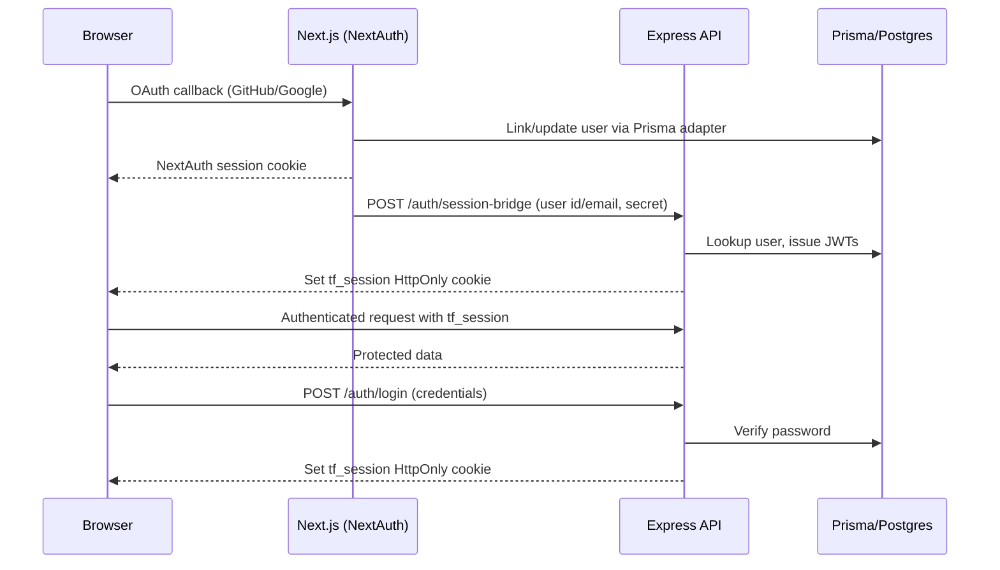

# PRD — TaskForge (Monorepo)

## Overview
- **Goal:** Production-like personal task manager in ≤ 1 week, highlighting OAuth, REST, RBAC‑ready design, OpenAPI, tests, Docker, CI, DB migrations, and refined UI (dark/classy with animations).
- **Monorepo:** `apps/web`, `apps/api`, `packages/shared`, `infra`, `docs`.

## Users
- Primary: single user (personal). Future: org workspaces.

## Success
- Deployed FE/BE/DB on free tiers. OAuth login, CRUD tasks (tags + due dates), Kanban, filters/search, basic email digest, Swagger at `/api/taskforge/docs`, 10–20 tests, `.http` suite, Docker + CI, README + ADRs.

## Scope
- Auth: NextAuth (GitHub/Google) backed by Prisma, credential login against the API, and a session bridge that exchanges
  NextAuth sessions for API `tf_session` cookies via `SESSION_BRIDGE_SECRET`.
- Tasks: title, description (MD), status, priority, **tags**, **dueDate**.
- Kanban: DnD with optimistic UI.
- Filters/search: tag/status/due range/text.
- Email: daily digest + welcome email (toggle).
- UI: Next.js, Tailwind, shadcn/ui, Framer Motion, desktop-first dark theme.
- Docs: Swagger/OpenAPI + ADRs. `.http` pack.
- Tests: Jest/Supertest + basic FE validation.

## Non-Goals (Phase 1)
- Multi-tenant orgs, role assignment, real-time, advanced analytics.

## Architecture
- FE: Next.js App Router (TS) with NextAuth database sessions, OAuth providers, and a server-side session bridge that mints
  API cookies before rendering protected routes.
- BE: Express (TS), Zod validation, Prisma (Postgres), Swagger. Auth router issues JWT access/refresh pairs, maintains
  `tf_session` HttpOnly cookies, and exposes a `session-bridge` endpoint for trusted frontends.
- DB: Neon/Supabase Postgres; Prisma migrations + seed.
- Email: Nodemailer; dev via MailHog.
- Infra: Dockerfiles + docker-compose; CI with GitHub Actions.

## Data Model (Prisma Sketch)
```prisma
model User {
  id        String   @id @default(cuid())
  email     String   @unique
  name      String?
  image     String?
  provider  String?
  createdAt DateTime @default(now())
  tasks     Task[]
}

model Task {
  id          String       @id @default(cuid())
  userId      String
  title       String
  description String?
  status      TaskStatus   @default(TODO)
  priority    TaskPriority @default(MEDIUM)
  dueDate     DateTime?
  createdAt   DateTime     @default(now())
  updatedAt   DateTime     @updatedAt
  user        User         @relation(fields: [userId], references: [id], onDelete: Cascade)
  TaskTag     TaskTag[]
}

model Tag {
  id    String   @id @default(cuid())
  label String   @unique
  TaskTag TaskTag[]
}

model TaskTag {
  taskId String
  tagId  String
  task   Task @relation(fields: [taskId], references: [id], references: [id], onDelete: Cascade)
  tag    Tag  @relation(fields: [tagId], references: [id], onDelete: Cascade)
  @@id([taskId, tagId])
}

enum TaskStatus { TODO IN_PROGRESS DONE }
enum TaskPriority { LOW MEDIUM HIGH }
```

## API (v1)
- `GET /api/v1/health`
- `GET /api/v1/me`
- `GET /api/v1/tasks?status=&priority=&tag=&q=&dueFrom=&dueTo=&page=&pageSize=`
- `POST /api/v1/tasks`
- `PATCH /api/v1/tasks/:id`
- `DELETE /api/v1/tasks/:id`
- `GET /api/v1/tags`
- `POST /api/v1/tags`
- Docs: `GET /api/taskforge/docs`
- OpenAPI reference: [`docs/openapi.json`](./openapi.json)

## ADR Summary
- Auth: NextAuth + backend JWT verification with dedicated session bridge and shared Prisma adapter.
- Backend: Express TS + Zod + Swagger.
- DB: Postgres (Neon/Supabase) + Prisma.
- Email: Nodemailer adapter; MailHog dev; free SMTP prod.
- Monorepo rationale: shared types, unified tooling, single CI.

## Milestones (7 days)
- **Day 1:** Monorepo setup, Tailwind + shadcn/ui, Express + Prisma scaffold, Dockerfiles, compose, CI skeleton.
- **Day 2:** Frontend OAuth (GitHub/Google) with NextAuth, guarded routes, session UI, and the `/auth/session-bridge` flow to mint API cookies.
- **Day 3:** `/tasks` CRUD + Zod + tests; FE list + dialogs; OpenAPI draft.
- **Day 4:** Kanban DnD, `/tags`, optimistic UI, `.http` pack.
- **Day 5:** Search, due filters, priority; email digest (node-cron + Nodemailer).
- **Day 6:** Helmet/CORS/rate-limit; finalize Swagger; ADRs + README; CI docker build.
- **Day 7:** Provision Neon/Supabase; deploy API (Render/Railway) + Web (Vercel); smoke test; v1 release.

## Authentication Experience
- Users can authenticate with GitHub or Google through NextAuth (Auth.js) using the Prisma adapter to reuse shared user records. Verified OAuth logins trigger the server-side session bridge to call `/api/taskforge/v1/auth/session-bridge`, which returns JWTs and sets the API-managed `tf_session` cookie so backend routes trust the request.
- Email/password login remains available via `/api/taskforge/v1/auth/login`. The Next.js login form posts to the API, receives validation errors, and relies on the `tf_session` cookie for subsequent navigation without duplicating NextAuth.
- Authenticated layouts call `getCurrentUser()` server-side. If the NextAuth session exists it is used; otherwise the layout resolves the API user from the `tf_session` cookie and, when needed, exchanges it for a fresh token using the session bridge helper.
- Signing out from the web app clears both the NextAuth session and the API cookie through the `/api/auth/logout` Next.js route, which invokes the API logout endpoint and expires `tf_session` on the server.

### Auth Lifecycle Diagram


## Auth Decisions & Deviations
- **Session bridge implemented earlier than planned:** The original milestone assumed the JWT bridge would land after initial OAuth wiring. In practice, the bridge was required to make protected routes render reliably in Docker and to share auth between OAuth and credential logins, so `/auth/session-bridge` shipped alongside the OAuth integration.
- **Database-backed NextAuth sessions:** Instead of the default JWT session mode we keep the Prisma adapter’s session table so OAuth and credentials reuse the same user IDs that the API expects, avoiding mismatched subject claims.
- **Shared sign-out path:** A dedicated Next.js `/api/auth/logout` route coordinates clearing both the NextAuth session and the API cookie to prevent stale `tf_session` values after OAuth sign-out.
