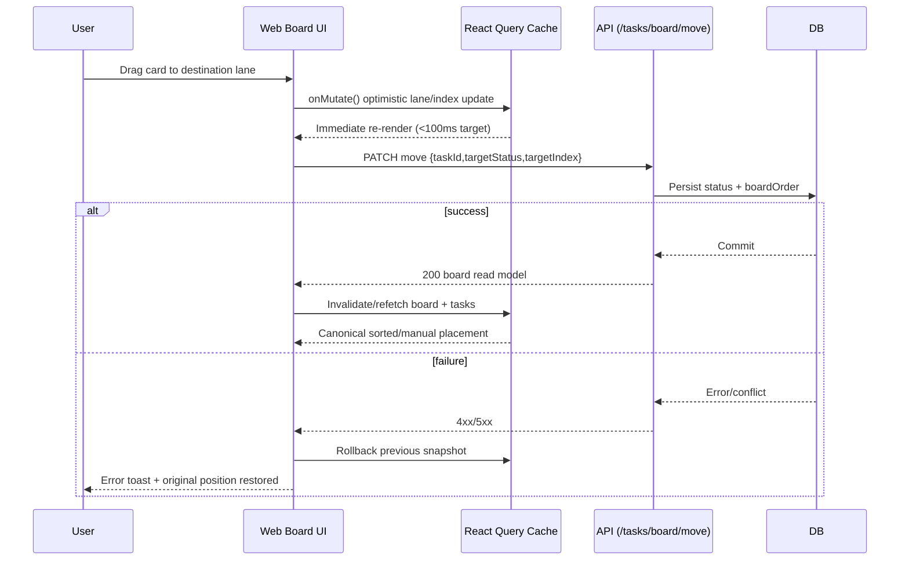
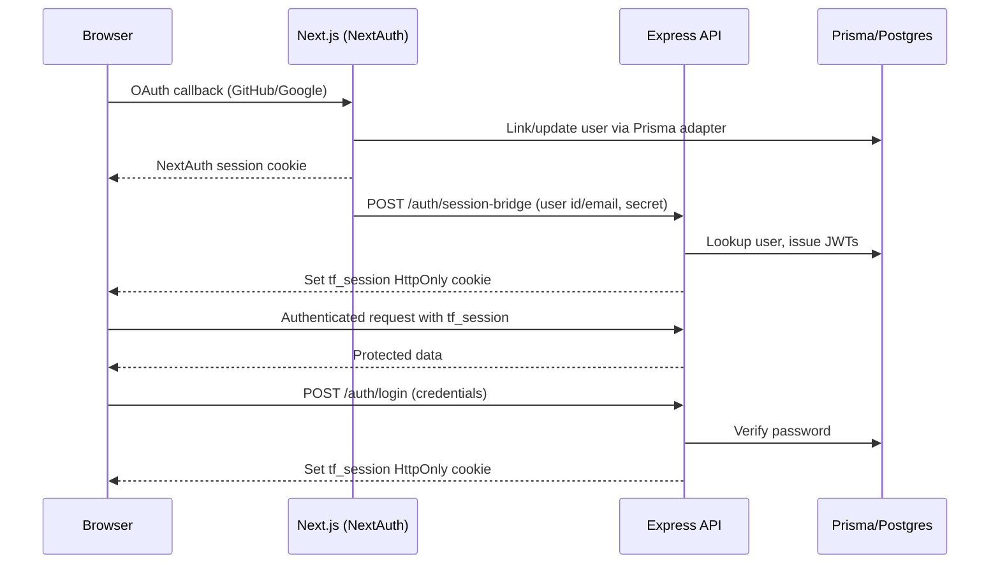

# PRD - TaskForge (Monorepo)

## Overview
- **Goal:** Production-like personal task manager in <= 1 week, highlighting OAuth, REST, RBAC-ready design, OpenAPI, tests, Docker, CI, DB migrations, and refined UI (dark/classy with animations).
- **Monorepo:** `apps/web`, `apps/api`, `packages/shared`, `infra`, `docs`.

## Users
- Primary: single user (personal). Future: org workspaces.

## Success
- Release-candidate app implemented locally: OAuth/credential login, CRUD tasks (tags + due dates), Kanban, filters/search, Swagger at `/api/taskforge/docs`, API and frontend automated tests, `.http` suite, Docker compose/dev images, README + ADRs. Day 7 deployment remains pending: FE/BE/DB must be provisioned on free tiers, real production env facts must be recorded, and production smoke must pass. Email delivery infrastructure, welcome emails, digest preferences, digest preview/manual-send flows, and the protected digest scheduler are staged; production scheduled sends remain gated on Resend verification, production fact-register completion, and observability checks.

## Scope
- Auth: NextAuth (GitHub/Google) backed by Prisma, credential login against the API, and a session bridge that exchanges
  NextAuth sessions for API `tf_session` cookies via `SESSION_BRIDGE_SECRET`.
- Tasks: title, description (MD), status, priority, **tags**, **dueDate**.
- Kanban: DnD with optimistic UI.
- Filters/search: tag/status/due range/text.
- Email: provider-neutral Nodemailer SMTP adapter with MailHog local defaults and Resend as the production SMTP default; welcome emails send after first account creation, and users can manage digest preferences, preview digest payloads, and trigger guarded manual digest sends. The digest scheduler runs through a protected API job endpoint with a Vercel Cron web proxy and GitHub Actions fallback.
- UI: Next.js, Tailwind, shadcn/ui, Framer Motion, desktop-first dark theme.
- Docs: Swagger/OpenAPI + ADRs. `.http` pack.
- Tests: Jest/Supertest for API coverage and Vitest/React Testing Library for frontend coverage.

## Non-Goals (Phase 1)
- Multi-tenant orgs, role assignment, real-time, advanced analytics.

## Architecture
- FE: Next.js App Router (TS) with NextAuth database sessions, OAuth providers, and a server-side session bridge that mints
  API cookies before rendering protected routes.
- BE: Express (TS), Zod validation, Prisma (Postgres), Swagger. Auth router issues JWT access/refresh pairs, maintains
  `tf_session` HttpOnly cookies, and exposes a `session-bridge` endpoint for trusted frontends.
- DB: Neon/Supabase Postgres; Prisma migrations + seed.
- Email: provider-neutral Nodemailer SMTP adapter; MailHog is available in local compose, and production configuration defaults to Resend SMTP once the sending domain and DNS are verified. Daily digest scheduling uses a protected API job endpoint invoked through the web app's Vercel Cron proxy when available, with GitHub Actions schedule as the free fallback.
- Infra: Dockerfiles + docker-compose; CI with GitHub Actions for lint/typecheck/tests/build. Docker image-build validation is a release gate documented for Milestone 6 and must either run locally or be added to CI before Day 7 release sign-off.

## Data Model (Prisma Sketch)
```prisma
model User {
  id            String   @id @default(uuid()) @db.Uuid
  email         String   @unique
  passwordHash  String?
  name          String?
  image         String?
  emailVerified DateTime?
  createdAt     DateTime @default(now())
  updatedAt     DateTime @updatedAt
  tasks         Task[]
  tags          Tag[]
  emailPreference        EmailPreference?
  notificationDeliveries NotificationDelivery[]
}

model Task {
  id          String       @id @default(uuid()) @db.Uuid
  userId      String       @db.Uuid
  title       String
  description String?
  status      TaskStatus   @default(TODO)
  priority    TaskPriority @default(MEDIUM)
  boardOrder  Int          @default(0)
  dueDate     DateTime?
  createdAt   DateTime     @default(now())
  updatedAt   DateTime     @updatedAt
  user        User         @relation(fields: [userId], references: [id], onDelete: Cascade)
  TaskTag     TaskTag[]

  @@unique([id, userId])
}

model Tag {
  id      String    @id @default(uuid()) @db.Uuid
  userId  String    @db.Uuid
  label   String
  TaskTag TaskTag[]
  user    User      @relation(fields: [userId], references: [id], onDelete: Cascade)

  @@unique([id, userId])
  @@unique([userId, label])
}

model TaskTag {
  taskId String @db.Uuid
  tagId  String @db.Uuid
  userId String @db.Uuid
  task   Task   @relation(fields: [taskId, userId], references: [id, userId], onDelete: Cascade)
  tag    Tag    @relation(fields: [tagId, userId], references: [id, userId], onDelete: Cascade)

  @@id([taskId, tagId])
  @@index([userId])
}

model EmailPreference {
  userId              String   @id @db.Uuid
  welcomeEmailEnabled Boolean  @default(true)
  dailyDigestEnabled  Boolean  @default(false)
  dailyDigestHourUtc  Int?
  dailyDigestTimezone String   @default("UTC")
  createdAt           DateTime @default(now())
  updatedAt           DateTime @updatedAt
  user                User     @relation(fields: [userId], references: [id], onDelete: Cascade)
}

model NotificationDelivery {
  id             String                        @id @default(uuid()) @db.Uuid
  userId         String                        @db.Uuid
  idempotencyKey String                        @unique
  type           NotificationDeliveryType
  recipient      String
  createdAt      DateTime                      @default(now())
  updatedAt      DateTime                      @updatedAt
  user           User                          @relation(fields: [userId], references: [id], onDelete: Cascade)
  attempts       NotificationDeliveryAttempt[]

  @@index([userId, type])
}

model NotificationDeliveryAttempt {
  id                String                     @id @default(uuid()) @db.Uuid
  deliveryId        String                     @db.Uuid
  attemptNumber     Int
  type              NotificationDeliveryType
  recipient         String
  status            NotificationDeliveryStatus
  provider          String
  providerMessageId String?
  providerMetadata  Json?
  errorCode         String?
  errorMessage      String?
  attemptedAt       DateTime                   @default(now())
  deliveredAt       DateTime?
  createdAt         DateTime                   @default(now())
  updatedAt         DateTime                   @updatedAt
  delivery          NotificationDelivery       @relation(fields: [deliveryId], references: [id], onDelete: Cascade)

  @@unique([deliveryId, attemptNumber])
  @@index([status, attemptedAt])
}

enum TaskStatus { TODO IN_PROGRESS DONE }
enum TaskPriority { LOW MEDIUM HIGH }
enum NotificationDeliveryType { WELCOME DAILY_DIGEST }
enum NotificationDeliveryStatus { PENDING SENT FAILED SKIPPED }
```

## API (v1)
- `GET /api/taskforge/v1/health`
- `GET /api/taskforge/v1/me`
- `PATCH /api/taskforge/v1/me/email-preferences`
- `GET /api/taskforge/v1/tasks?status=&priority=&tag=&q=&dueFrom=&dueTo=&page=&pageSize=`
- `POST /api/taskforge/v1/tasks`
- `PATCH /api/taskforge/v1/tasks/:id`
- `DELETE /api/taskforge/v1/tasks/:id`
- `GET /api/taskforge/v1/tasks/board?status=&priority=&tag=&q=&dueFrom=&dueTo=`
- `PATCH /api/taskforge/v1/tasks/board/move`
- `GET /api/taskforge/v1/tags`
- `POST /api/taskforge/v1/tags`
- `GET /api/taskforge/v1/email/digest/preview?timezone=&dueSoonDays=&recentlyUpdatedDays=&maxTasksPerGroup=`
- `POST /api/taskforge/v1/email/digest/send`
- `GET /api/taskforge/v1/jobs/digest?digestDate=&dryRun=&sendLimit=&digestHourUtc=` (`digestDate` is optional for scheduled runs; when omitted, the API derives each user's local digest date from their configured timezone)
- `POST /api/taskforge/v1/jobs/digest`
- Web cron proxy: `GET /api/cron/digest`
- Docs: `GET /api/taskforge/docs`
- OpenAPI reference: [`docs/openapi.json`](./openapi.json)

## ADR Summary
- Auth: NextAuth + backend JWT verification with dedicated session bridge and shared Prisma adapter.
- Backend: Express TS + Zod + Swagger.
- DB: Postgres (Neon/Supabase) + Prisma.
- Email: ADR 0003 records the Nodemailer adapter, MailHog dev path, and Resend SMTP production default. Production ADR 0006 records the free-tier digest scheduler invocation path.
- Monorepo rationale: shared types, unified tooling, single CI.


## Milestone 4 - Kanban + Tags (Shipped Behavior)

### Goals
- Deliver a board-first workflow where status changes happen in one drag interaction and persist through `PATCH /api/taskforge/v1/tasks/board/move`.
- Keep tagging lightweight: users can create tags once, reuse them from dialogs/filters, and trust normalization (`trim + lowercase uniqueness`) to avoid duplicates.
- Preserve fast feedback with optimistic updates while preventing invisible data corruption when mutations fail.

### Success Metrics
- **Interaction speed:** median drag-to-visual-update under 100 ms on local/dev environments (optimistic move visible immediately after drop).
- **Reliability:** board and list views reconverge within one refetch cycle after every successful move mutation.
- **Recovery quality:** failed optimistic moves rollback cleanly and show actionable feedback (toast + restored card position).
- **Tag quality:** no duplicate labels per user (`@@unique([userId, label])` enforced in schema + API conflict handling).

### UX Notes (mirrors implementation)
- **Manual Board Order mode:** same-column reorder and cross-column placement are both enabled; drop indicators show exact insertion points.
- **Sorted modes (Due date / Priority / Updated):** same-column reorder is intentionally disabled; cross-column drops only change status from the user perspective.
- **Hidden index behavior in sorted modes:** client sends deterministic `targetIndex` (end of destination lane) while rendered position is recalculated by active sort after mutation/refetch.
- **Drop affordance:** sorted modes highlight the entire destination column, not a line-level insertion marker.
- **Helper copy:** users are told to switch to Board order for explicit manual ordering.

### Drag + Optimistic Update Lifecycle

```mermaid
sequenceDiagram
    participant U as User
    participant B as Web Board UI
    participant C as React Query Cache
    participant A as API (/tasks/board/move)
    participant D as DB

    U->>B: Drag card to destination lane
    B->>C: onMutate() optimistic lane/index update
    C-->>B: Immediate re-render (<100ms target)
    B->>A: PATCH move {taskId,targetStatus,targetIndex}
    A->>D: Persist status + boardOrder
    alt success
      D-->>A: Commit
      A-->>B: 200 board read model
      B->>C: Invalidate/refetch board + tasks
      C-->>B: Canonical sorted/manual placement
    else failure
      D-->>A: Error/conflict
      A-->>B: 4xx/5xx
      B->>C: Rollback previous snapshot
      B-->>U: Error toast + original position restored
    end
```

### QA References (Milestone 4)
- Manual checklist: `docs/testing/milestone4-manual-checklist.md`
- Automated/API checks: `docs/testing/milestone4-automated.md`
- HTTP pack: `apps/api/tests/kanban.http`

## Milestones (7 days)
| Day | Status | Scope | Release-readiness notes |
| --- | --- | --- | --- |
| **Day 1** | Shipped locally | Monorepo setup, Tailwind + shadcn/ui, Express + Prisma scaffold, Dockerfiles, compose, CI skeleton. | Run migrations/seed before API smoke in any environment. |
| **Day 2** | Shipped locally | Frontend OAuth (GitHub/Google) with NextAuth, guarded routes, session UI, and the `/auth/session-bridge` flow to mint API cookies. | OAuth providers are env-gated; production provider enablement still requires real callback URLs and secrets. |
| **Day 3** | Shipped locally | `/tasks` CRUD, list search/due/priority filters, Zod + tests; FE list + filter UI + dialogs; OpenAPI draft. | Web task clients call the API directly; there is no general Next.js task proxy. |
| **Day 4** | Shipped locally | Kanban DnD, `/tags`, board filters/search, optimistic UI, `.http` pack. | Manual board order and sorted-mode drag behavior are intentionally different. |
| **Day 5** | Implemented locally; production sends gated | Welcome email, digest preferences, preview/manual send, guarded scheduler path. | Resend, real scheduled sends, and production digest schedule stay disabled until the fact register and observability gates pass. |
| **Day 6** | Hardening/docs release-candidate, with explicit release gates | Helmet/CORS/rate-limit, trusted proxy/cookie docs, OpenAPI finalization, README/ADR refresh, Docker/compose validation docs. | v1 rate limits assume one API instance or a shared rate-limit store before horizontal scaling; CI Docker image builds are not complete unless the workflow or release log shows them. |
| **Day 7** | Pending deployment work | Provision Neon/Supabase; deploy API (Render/Railway) + Web (Vercel); configure real env facts; smoke test; v1 release. | Must fill production placeholders without committing secrets and preserve the local-implemented vs production-enabled distinction for OAuth, Resend, digest scheduling, and cross-subdomain cookies. |

## Authentication Experience
- Users can authenticate with GitHub or Google through NextAuth (Auth.js) using the Prisma adapter to reuse shared user records. Verified OAuth logins trigger the server-side session bridge to call `/api/taskforge/v1/auth/session-bridge`, which returns JWTs and sets the API-managed `tf_session` cookie so backend routes trust the request.
- Email/password login remains available via `/api/taskforge/v1/auth/login`. The Next.js login form posts to the API, receives validation errors, and relies on the `tf_session` cookie for subsequent navigation without duplicating NextAuth.
- Authenticated layouts call `getCurrentUser()` server-side. If the NextAuth session exists it is used; otherwise the layout resolves the API user from the `tf_session` cookie and, when needed, exchanges it for a fresh token using the session bridge helper.
- Signing out from the web app clears both the NextAuth session and the API cookie through the `/api/auth/logout` Next.js route, which invokes the API logout endpoint and expires `tf_session` on the server.

### Auth Lifecycle Diagram

```mermaid
sequenceDiagram
    participant Browser
    participant NextAuth as Next.js (NextAuth)
    participant API as Express API
    participant DB as Prisma/Postgres

    Browser->>NextAuth: OAuth callback (GitHub/Google)
    NextAuth->>DB: Link/update user via Prisma adapter
    NextAuth-->>Browser: NextAuth session cookie
    NextAuth->>API: POST /auth/session-bridge (user id/email, secret)
    API->>DB: Lookup user, issue JWTs
    API-->>Browser: Set tf_session HttpOnly cookie
    Browser->>API: Authenticated request with tf_session
    API-->>Browser: Protected data

    Browser->>API: POST /auth/login (credentials)
    API->>DB: Verify password
    API-->>Browser: Set tf_session HttpOnly cookie
```

## Auth Decisions & Deviations
- **Session bridge implemented earlier than planned:** The original milestone assumed the JWT bridge would land after initial OAuth wiring. In practice, the bridge was required to make protected routes render reliably in Docker and to share auth between OAuth and credential logins, so `/auth/session-bridge` shipped alongside the OAuth integration.
- **Database-backed NextAuth sessions:** Instead of the default JWT session mode we keep the Prisma adapter's session table so OAuth and credentials reuse the same user IDs that the API expects, avoiding mismatched subject claims.
- **Shared sign-out path:** A dedicated Next.js `/api/auth/logout` route coordinates clearing both the NextAuth session and the API cookie to prevent stale `tf_session` values after OAuth sign-out.

## Tasks Experience (Dashboard + Dialogs)
- **End-to-end flow:** Authenticated users land on the task dashboard, which loads task data via `/api/taskforge/v1/tasks` using the shared `tf_session` cookie or Bearer token from the session bridge. The UI renders status columns, badges for priority/tags, and empty-state callouts when filters return zero results. The decisions behind the session bridge and data storage live in [ADR 0001](docs/adr/0001-auth-strategy-nextauth-%2B-backend-jwt.md) and [ADR 0002](docs/adr/0002-database-postgres-+-prisma.md).
- **Filters + tags:** Filters (status, priority, tag, search, due date range) map 1:1 to API query parameters. Tag entry is normalized to the shared tag list so list, create, and update requests stay aligned across the API and UI. The dashboard exposes quick filters for common combinations (for example, In Progress + High priority) so users can drill into the work queue quickly.
- **Create/edit dialogs:** Create and edit dialogs surface the same fields (title, description, status, priority, due date, tags), run Zod validation, and submit through React Query mutations. Successful actions optimistically update the task list and kanban preview; validation errors show inline with a destructive toast for visibility. Edits can clear optional description and due date fields, and if a task is deleted while editing, the dialog closes with a conflict notice.
- **Screenshots/GIFs:** Approved dashboard, filter, and dialog assets are not committed yet. Attach screenshots to PRs when useful and add final approved assets before publishing externally.
- **Known limitations:** UI pagination controls are not exposed yet (the list defaults to the first page), and dedicated tag administration is not included; tag creation, selection, and filtering remain embedded in task dialogs and board/list filters.

## Email scope and current limitations (Milestone 5)
- **Implemented local/release-candidate scope:** SMTP adapter, MailHog local verification path, Resend SMTP production defaults, welcome email dispatch, digest preferences, digest preview/manual-send APIs, and protected scheduled invocation route.
- **Still manual before production sends:** selecting and verifying the exact production sending domain, storing Resend API keys per deployment target, filling every production fact-register placeholder, running manual-only Resend/observability checks, and approving first production digest schedule/send budget/escalation workflow.
- **Free-tier constraints:** keep `EMAIL_DAILY_SEND_LIMIT` conservative (default `90`) and track provider quota/rate-limit outcomes before enabling unattended scheduled sends.

## Task dialog UX
- **Creation:** The dashboard and hooks demo use buttons with `data-task-dialog="create"` to launch the modal form. It runs the shared Zod schema with `react-hook-form`, sanitizes tags/due dates, and optimistically inserts the task into the page-one cache so the kanban preview updates instantly.
- **Editing:** Every task card includes an **Edit** action annotated with `data-task-dialog="edit" data-task-id="<id>"`. The dialog loads the record directly from the React Query cache, keeps in sync with background updates, and exposes the same editable fields (title, description, status, priority, due date, tags). Submissions call `useUpdateTask`; validation errors render inline, successful saves show a toast, and missing/deleted tasks close the dialog with a conflict notice.
